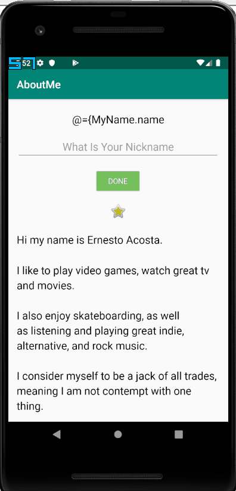

# AboutMe

An Android application that says a little bit about me.

Submitted by: Ernesto Acosta

Time spent: 2 hours

## User Stories

The following **required** functionality is complete:

* [x] Implemented LinearLayout view group.
* [x] Added interactive button.
* [x] Optimize app by using lateinit to search view hierarchy only once.
* [x] User can press button to simulate a die roll.

The following **additional** features are implemented:

* [ ] List anything else that you can get done to improve the app functionality!

## Video Walkthrough 

Here's a walkthrough of implemented user stories:

## Notes

Didn't really have any challenges with this app.

## License

Copyright 2018 Ernesto Acosta

Licensed under the Apache License, Version 2.0 (the "License");
you may not use this file except in compliance with the License.
You may obtain a copy of the License at

http://www.apache.org/licenses/LICENSE-2.0

Unless required by applicable law or agreed to in writing, software
distributed under the License is distributed on an "AS IS" BASIS,
WITHOUT WARRANTIES OR CONDITIONS OF ANY KIND, either express or implied.
See the License for the specific language governing permissions and
limitations under the License.
